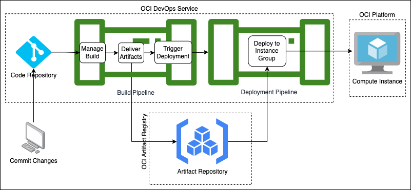

# Using OCI DevOps to build and deploy a Java-based Helidon MP Application

This example will demonstrate how to pair Helidon with OCI DevOps pipeline to build a quick start Helidon MP application and deploy to either an OCI Instance, an OKE Cluster or both.

## Objective
1. Create an OCI DevOps project that will build and deploy a Helidon MP application example.
2. Create an Instance Group or OKE Cluster deployment targets.
3. Use Terraform to create automation of OCI resources provisioning that will be needed to build the DevOps environment.
4. Provide a quick tutorial on how to add OCI Object Storage integration into a Helidon application.
5. Use OCI cloud-shell to run this example through. 

## Prerequisite
- An OCI tenancy that can provision a Compute Node and work with the DevOps Service such as a paid service. This will also work on the free trial of the [OCI Free Tier](https://docs.oracle.com/en-us/iaas/Content/FreeTier/freetier.htm).

## Tasks
### Set up Cloud Shell/Cloud Editor access.
1. If you are already a super-user with administrator rights that has access to all resources in the tenancy, skip to the next section. Otherwise, continue to the next step.
2. Create a new group and add your user as a member of that group.
3. Create a new policy and provide that group a cloud-shell access:
   ```
   Allow group '<my_cloud_shell_access_group>' to use cloud-shell in tenancy
   ```
4. Verify that it works by opening the OCI Code Editor

### Clone the main repository for this lab exercise
1. Start the OCI Code Editor if it is not yet open.
2. Open a new terminal from the Code Editor. On the terminal, make sure you are in the home directory
   ```shell
   cd ~
   ```
3. Use git to clone the main repository. This will create `oci-devops-helidon-example` directory in the home directory.
   ```shell
   git clone https://github.com/klustria/oci-devops-helidon-example.git
   ```

### Prepare the environment
The goal of this task is to prepare the environment for the DevOps setup by creating a Compartment, Dynamic Groups, User Group and Polices. This section requires a user with administrator privilege. If you don't have it, make sure to request another user with such privilege to run this for you.
1. Open the newly cloned repository directory `oci-devops-helidon-example` from the code editor.
2. From the root directory of the repository, open `terraform.tfvars` and set the values of the following variables: 
   * `tenancy_ocid` - This can be retrieved by opening the `Profile` menu and click `Tenancy: <your_tenancy_name>`. The tenancy OCID is shown under `Tenancy Information`. Click `Show` to display the entire ID or click `Copy` to copy it to your clipboard.
   * `region` - From OCI Console's home screen, open the `Region` menu, and then click `Manage Regions`. Locate the Home Region and copy the Region identifier.
   * `user_ocid` - This can be retrieved by opening the `Profile` menu and clicking on `My Profile`. Under `User information`, click `Show` to display the entire ID or click `Copy` to copy it to your clipboard.

   **Note:** Ensure that `region` reflects your home region as this exercise will not work in other regions. If DevOps resources provisioning, that will be performed in the next section, will be done on the same home region, then use the `region` parameter for this purpose. However, if the intention is to target DevOps provisioning on a different non-home region, then for this step, set the value of the `home_region` parameter instead.
3. Go to the `init` directory.
   ```shell
   cd init
   ```
4. Use Terraform to execute the scripts to provision the compartment, dynamic groups and polices.
   ```bash
   terraform init
   terraform plan
   terraform apply -auto-approve
   ```
### Provision all resources required to set up the OCI DevOps.
1. Open `oci-devops-helidon-example` project from Code Editor.
2. From the root directory of the project, open `terraform.tfvars` and fill up the values of the following variables:
   * `tenancy_ocid` - If already set from the previous exercise, leave as is. Otherwise, this can be retrieved by opening the `Profile` menu and click `Tenancy: <your_tenancy_name>`. The tenancy OCID is shown under `Tenancy Information`. Click `Show` to display the entire ID or click `Copy` to copy it to your clipboard.
   * `region` - If already set from the previous exercise, leave as is. Otherwise, from OCI Console's home screen, open the `Region` menu, and then click `Manage Regions`. Locate the Home Region and copy the Region identifier.
   * `compartment_ocid` - This can be automatically populated by running the tool `update_compartment.sh` or otherwise, value can be retrieved from the previous exercise's terraform output.
     ```shell
     utils/update_compartment.sh
     ```
   * `deployment_target` - Choose the deployment target destination. Allowed values are the following (not case sensitive):
     1. INSTANCE - Deploys to a provisioned instance
     2. OKE      - Deploys to a provisioned OKE Cluster
     3. ALL      - Deploys to both OKE and INSTANCE. This is the default value. 
3. Open a new terminal and go to `main` directory,
   ```shell
   cd main
   ```
4. Use Terraform to execute the scripts to provision all the DevOps resources.
    ```bash
    terraform init
    terraform plan
    terraform apply -auto-approve
    ```
   This will provision the following resources:
   * OCI DevOps Service
     1. `OCI DevOps Project` that will contain all the DevOps components needed for this project. 
     2. `OCI Code Repository` that will host the Application source code project.
     3. `DevOps Build Pipeline` for the `INSTANCE` if configured, with the following stages:
        1. Manage Build - Executes steps to download JDK20, maven and building the Helidon application.
        2. Deliver Artifacts - Uploads the built Helidon app and the Deployment spec to the Artifact Repository.
        3. Trigger Deployment - Triggers the Instance's Deployment Pipeline.
     4. `DevOps Deployment Pipeline` for the `INSTANCE` if configured, that will perform the following on the target environment:
        1. Download JDK20
        2. Install OCI CLI and use it to download the Application Deliverable
        3. Run the Application
     5. `DevOps Build Pipeline` for `OKE` if configured, with the following stages:
        1. Manage Build - Executes a Dockerfile to build the application  as a Docker image.
        2. Deliver Artifacts - Uploads image to the Container Registry  and the Deployment spec to the Artifact Repository
        3. Trigger Deployment - Triggers the OKE's Deployment Pipeline.
     6. `DevOps Deployment Pipeline` for `OKE` if configured, that will perform the following on the target environment:
        1. Create a Kubernetes service with LoadBalancer type.
        2. Create a Kubernetes deployment using the built docker image
     7. `DevOps Trigger` for the `INSTANCE` and `OKE`, whichever is configured, that will invoke the pipeline lifecycle from start to finish when a push event occurs on the `OCI Code Repository`.
   * OCI Artifact Registry
     1. `OCI Artifact Repository` that will host the built Helidon App Binaries and Deployment Manifest as versioned artifacts.
     2. `OCI Container Registry` that will host the built Helidon App as a versioned Docker image. 
   * OCI Platform
     1. `INSTANCE` if configured.
        1. `OCI Compute Instance` that opens port 8080 from the firewall. This is where the application will be eventually deployed.
        2. `OCI Virtual Cloud Network (VCN)` with `Security List` containing an Ingress that opens port 8080. Port 8080 is where the Helidon application will be accessed from. The `OCI VCN` will be used by the `OCI Compute Instance` for its network needs.
     2. `OKE` if configured.
        1. `OKE Cluster` that will host the application as a Kubernetes deployment.
        2. `OKE Node Pool` with 1 worker node.
        3. `OCI Virtual Cloud Network (VCN)` with `Subnets` and `Security Lists` for the Kubernetes API endpoint, Worker Node, and LoadBalancer.
5. Diagram below depicts how the DevOps setup will work: 

   
    
### Prepare the Helidon Application:
1. Generate an auth token that will be used to access the DevOps code repository. From the OCI Console's home screen, open the Profile menu and click My Profile. Under `Resources`, click on `Auth tokens` and then click `Generate token` and fill in the `Description`. A new window will open with a notice to `Copy the generated token as it will not be shown again`. Do so and ensure to keep it in a safe place for future usage.
2. Go to the home directory
   ```shell
   cd ~
   ```
3. Download Helidon cli.
   ```shell
   curl -L -O https://helidon.io/cli/latest/linux/helidon
   chmod +x ./helidon
   ```
4. Execute the cli to generate a Helidon Microprofile application project.
   ```shell
   ./helidon init
   ```
5. When it prompts for `Helidon version`, enter `4.0.0-ALPHA6`
   ```shell
   Helidon version (default: 3.2.2): 4.0.0-ALPHA6
   ```
6. When prompted to `Select a Flavor`, choose `Helidon MP`
   ```shell
   | Helidon Flavor
 
   Select a Flavor
   (1) se   | Helidon SE
   (2) mp   | Helidon MP
   (3) nima | Helidon Níma
   Enter selection (default: 1): 2
   ```
7. When prompted to `Select an Application Type`, choose `OCI`  
   ```shell
   Select an Application Type
   (1) quickstart | Quickstart
   (2) database   | Database
   (3) custom     | Custom
   (4) oci        | OCI
   Enter selection (default: 1): 4
   ```
8. When prompted for `Project groupId`, `Project artifactId` and `Project version`, just accept the default values. 
9. When prompted for `Java package name`, use `demo.mp.oci`
   ```shell
   Java package name (default: me.first_last.mp.oci): demo.mp.oci
   ```
10. Once completed, this will generate an `oci-mp` project. Open `oci-mp` from Code Editor followed by starting a new terminal.
11. The terminal should already be in the `oci-mp` directory, but if it is not, go inside that directory.
    ```shell
    cd ~/oci-mp
    ```
12. Copy the build and deployment pipeline specs from the `oci-devops-helidon-example` repository.
    ```shell
    cp ~/oci-devops-helidon-example/pipeline_specs/* .
    ```
13. Add .gitignore so files and directories that are not needed to be part of the repository will be ignored by git.
    ```shell
    cp ~/oci-devops-helidon-example/.gitignore .
    ```
14. Copy the `Dockerfile` and replace the existing. This will be used to create the application as a Docker image if the deployment target is OKE, otherwise this step can be skipped. This step will also not be needed in a future version of the Helidon archetype as it will generate the proper Dockerfile.
    ```shell
    cp ~/oci-devops-helidon-example/main/Dockerfile .
    ```
15. Initialize the oci-mp project directory to become a git repository.
    ```shell
    git init
    ```
16. Set the branch to `main` to match the corresponding remote branch.
    ```shell
    git checkout -b main
    ```
17. Set the remote repository. Use the OCI Code Repository's https url displayed from the last terraform output or use the `get.sh` tool from `oci-devops-helidon-example` to retrieve that value.
    ```shell
    git remote add origin $(~/oci-devops-helidon-example/main/get.sh code_repo_https_url)
    git remote -v
    ```
18. Configure git to use credential helper store so that oci repository's username and password will be entered only once on git commands that require them. Also, set user.name and user.email which is required by git commit.
    ```shell
    git config credential.helper store
    git config --global user.email "my.name@example.com"
    git config --global user.name "FIRST_NAME LAST_NAME"
    ```
19. Synchronize the oci repository's git log with the local repository by using git pull.
    ```shell
    git pull origin main
    ```
20. This will prompt for username and password. Use `<tenancy name>/<username>` for the username and oci user auth token that was generated at the very start of this section for the password.
    ```shell
    Username for 'https://devops.scmservice.us-ashburn-1.oci.oraclecloud.com': tenancy_name/my.name@example.com
    Password for 'https://tenancyname/my.name@example.com@devops.scmservice.us-ashburn-1.oci.oraclecloud.com':
    ```
21. Run the utility script from the main repository (`oci-devops-helidon-example`) to update the Config parameters:
    ```shell
    ~/oci-devops-helidon-example/utils/update_config_values.sh
    ```
    Invoking this script will perform the following:
    1. Updates in `~/oci-mp/server/src/main/resources/application.yaml` config file to set up a Helidon feature that sends Helidon generated metrics to the OCI monitoring service.
       1. compartmentId - Compartment ocid that is used for this demo
       2. namespace - This can be any string but for this demo, this will be set to `helidon_metrics`.
    2. Updates in `~/oci-mp/server/src/main/resources/META-INF/microprofile-config.properties` config file to set up configuration parameters used by the Helidon app code to perform integration with OCI Logging and Metrics service.
       1. oci.monitoring.compartmentId - Compartment ocid that is used for this demo
       2. oci.monitoring.namespace - This can be any string but for this demo, this will be set to `helidon_application`.
       3. oci.logging.id - Application log id that was provisioned by the terraform scripts.
    3. Update in `~/oci-mp/server/src/main/resources/META-INF/microprofile-config.properties` config file to set up `oci.bucket.name` property to contain the Object Storage bucket name that was provisioned by the terraform scripts that will be used in a later exercise to demonstrate Object Storage support from a Helidon application.

    **Note:** Make sure to validate that `application.yaml` and `microprofile-config.properties` has been updated by opening them from Code Editor and checking that the mentioned config parameters had been properly populated.
22. Stage all the files for git commit
    ```shell
    git add .
    git status
    ```
23. Perform the first commit
    ```shell
    git commit -m "Helidon oci-mp first commit"
    ```
24. Push the changes to the remote repository
    ```shell
    git push -u origin main
    ```
25. This will trigger the DevOps to start the pipeline. Go to the DevOps project from the OCI console and observe the build and deployment pipeline logs.

### Exercise the deployed Helidon application:
1. If a compute instance was configured as the deployment target, i.e. `deployment_target` is set to `INSTANCE` or `ALL`, access the application by using curl to do a GET & PUT http requests.
    1. Set the endpoint using the instance's public ip:
       ```shell
       export ENDPOINT_IP=$(~/oci-devops-helidon-example/main/get.sh public_ip)
       echo "Instance public ip is $ENDPOINT_IP"
       ```
    2. Hello world request:
       ```shell
       curl http://$ENDPOINT_IP:8080/greet
       ```
       results to:
       ```shell
       {"message":"Hello World!","date":[2023,5,10]}
       ```
    3. Hello to a name, i.e. to `Joe`:
       ```shell
       curl http://$ENDPOINT_IP:8080/greet/Joe
       ```
       results to:
       ```shell
       {"message":"Hello Joe!","date":[2023,5,10]}
       ```
    4. Replace Hello with another greeting word, i.e. `Hola`:
       ```shell
       curl -X PUT -H "Content-Type: application/json" -d '{"greeting" : "Hola"}' http://$ENDPOINT_IP:8080/greet/greeting 
       curl http://$ENDPOINT_IP:8080/greet
       ```
       results to:
       ```shell
       {"message":"Hola World!","date":[2023,5,10]}
       ```
2. If OKE was configured as the deployment target, i.e. `deployment_target` is set to `OKE` or `ALL`, access the application by using curl to do GET & PUT rest requests.
    1. Set the endpoint using the LoadBalancer's external IP:
       ```shell
       export ENDPOINT_IP=$(kubectl --kubeconfig=$HOME/oci-devops-helidon-example/main/generated/kubeconfig get services oci-mp-server -o jsonpath='{.status.loadBalancer.ingress[].ip}')
       echo "Kubernetes LoadBalancer ip is $ENDPOINT_IP"
       ```
    2. Hello world request:
       ```shell
       curl http://$ENDPOINT_IP:8080/greet
       ```
       results to:
       ```shell
       {"message":"Hello World!","date":[2023,5,10]}
       ```
    3. Hello to a name, i.e. to `Joe`:
       ```shell
       curl http://$ENDPOINT_IP:8080/greet/Joe
       ```
       results to:
       ```shell
       {"message":"Hello Joe!","date":[2023,5,10]}
       ```
    4. Replace Hello with another greeting word, i.e. `Hola`:
       ```shell
       curl -X PUT -H "Content-Type: application/json" -d '{"greeting" : "Hola"}' http://$ENDPOINT_IP:8080/greet/greeting 
       curl http://$ENDPOINT_IP:8080/greet
       ```
       results to:
       ```shell
       {"message":"Hola World!","date":[2023,5,10]}
       ```
3. Validate that the Helidon Metrics are pushed to the OCI Monitoring Service using the OCI metric integration that was added in the Helidon application:
   1. From the OCI Console, go to `Observability & Management` -> Metrics Explorer (under Monitoring).
   2. On Query 1, below the blank graph, choose the compartment with a value that has the format of  `devops-compartment-helidon-demo-<4 char random value>`.
   3. Select `helidon_metrics` under Metric Namespace.
   4. Select `requests.count_counter` under Metric Name
   5. Above the empty graph, you can choose values for `Start time/End Time` or choose the time duration under `Quick Selects`.
   6. Click `Update Chart` at the bottom of `Query 1` to show all the metric data for the `request count`.
   7. You can also explore other Metrics by going back to step 4 and choosing a new value. 
4. Validate OCI Logging SDK integration that was added in the Helidon application. This will push log messages to the OCI Logging Service:
   1. From the OCI Console, go to `Observability & Management` -> `Logs (under Logging)`.
   2. Change Compartment with a value that has the format of `devops-compartment-helidon-demo-<4 char random value>`.
   3. Choose and click on `app-log-helidon-demo` from the Logs Table.
   4. Choose `Filter by time` value within the scope of your last request. For example, you can choose `Today` to see all request that was made today.
   5. The `Explore Log` display should output some graphs of the logging activity and will also show a table of the logs that has been captured.
5. The Helidon oci-mp application adds Health Check feature to validate `liveness` and/or `readiness`. You can check `GreetLivenessCheck` and `GreetReadinessCheck` class files respectively in the project to see how they are done. This will particularly be useful when running the app as a microservice on an orchestrator environment like Kubernetes to determine if the microservice needs to be restarted if it is not healthy. Specific to this lab, the `readiness` check is leveraged in the `DevOps deployment pipeline spec` after the app is started to determine if the Helidon application started successfully. Check out code at [line #79 in deployment_spec.yaml](pipeline_specs/deployment_instance.yaml) to see it in action.
   1. If a compute instance was configured as the deployment target, i.e. `deployment_target` is set to `INSTANCE` or `ALL`:
      1. Set the endpoint using the instance's public ip:
         ```shell
         export ENDPOINT_IP=$(~/oci-devops-helidon-example/main/get.sh public_ip)
         echo "Instance public ip is $ENDPOINT_IP"
         ```
      2. Liveness Check
         ```shell
         curl http://$ENDPOINT_IP:8080/health/live
         ```
         results to:
         ```shell
         {"status":"UP","checks":[{"name":"CustomLivenessCheck","status":"UP","data":{"time":1684391639448}}]}
         ```
      3. Readiness Check
          ```shell
         curl http://$ENDPOINT_IP:8080/health/ready
         ```
         results to:
         ```shell
         {"status":"UP","checks":[{"name":"CustomReadinessCheck","status":"UP","data":{"time":1684391438298}}]}
         ```     
   2. If OKE was configured as the deployment target, i.e. `deployment_target` is set to `OKE` or `ALL`:
       1. Set the endpoint using the LoadBalancer's external IP:
          ```shell
          export ENDPOINT_IP=$(kubectl --kubeconfig=$HOME/oci-devops-helidon-example/main/generated/kubeconfig get services oci-mp-server -o jsonpath='{.status.loadBalancer.ingress[].ip}')
          echo "Kubernetes LoadBalancer ip is $ENDPOINT_IP"
          ```
       2. Liveness Check
          ```shell
          curl http://$ENDPOINT_IP:8080/health/live
          ```
          results to:
          ```shell
          {"status":"UP","checks":[{"name":"CustomLivenessCheck","status":"UP","data":{"time":1684391639448}}]}
          ```
       3. Readiness Check
           ```shell
          curl http://$ENDPOINT_IP:8080/health/ready
          ```
          results to:
          ```shell
          {"status":"UP","checks":[{"name":"CustomReadinessCheck","status":"UP","data":{"time":1684391438298}}]}
          ``` 
       
### Modify Helidon application code to add Object Storage support.
The objective of this exercise is to demonstrate how to add Object Storage access from the Helidon code. This is done by replacing a variable which is used to store the greeting word with an object that will now become the new greeting word container and is stored and retrieved from an Object Storage bucket. Since the object is persisted, the last greeting word value will survive application restarts. Without this change and with greeting word in memory via the variable, the greeting word will reset to default value when the application is restarted.
1. Make sure that Code Editor is open with `oci-mp` local directory as the active workspace
2. Open `pom.xml` under the `server` directory and add the Object Storage OCI SDK dependency inside the `dependencies` clause.
   ```xml
    <dependency>
        <groupId>com.oracle.oci.sdk</groupId>
        <artifactId>oci-java-sdk-objectstorage</artifactId>
    </dependency>
   ```
3. Perform the following updates to `oci-mp/server/src/main/java/demo/mp/oci/server/GreetingProvider.java`.
   1. Replace the existing GreetingProvider constructor method with the code that will have the following characteristics:
      1. From the constructor's argument section, add `ObjectStorage objectStorageClient` parameter. Since this is part of @Injected annotation, the parameter will automatically be processed and set by Helidon to contain the client which can be used to communicate with the Object Storage service without having to add several lines of OCI SDK code for that purpose. 
      2. From the same constructor's argument section, add ConfigProperty which will extract value from an `oci.bucket.name` property in the configuration. This has earlier been populated in `microprofile-config.properties` during the initial application setup when a utility script called `update_config_values.sh` was executed from the `oci-devops-helidon-example`  repository directory.
      3. Using getNamespace() Object Storage SDK method, \retrieve the Object Storage's namespace as it will be used later to retrieve or store an object:
         ```java
         public GreetingProvider(@ConfigProperty(name = "app.greeting") String message,
                                 ObjectStorage objectStorageClient,
                                 @ConfigProperty(name = "oci.bucket.name") String bucketName) {
             try {
                 this.bucketName = bucketName;
                 GetNamespaceResponse namespaceResponse =
                         objectStorageClient.getNamespace(GetNamespaceRequest.builder().build());
                 this.objectStorageClient = objectStorageClient;
                 this.namespaceName = namespaceResponse.getValue();
                 LOGGER.info("Object storage namespace: " + namespaceName);
                 setMessage(message);
             } catch (Exception e) {
                 LOGGER.warning("Error invoking getNamespace from Object Storage: " + e);
             }
         }     
         ``` 
   2. Right below the GreetingProvider class, remove the variable declaration:
      ```java
      private final AtomicReference<String> message = new AtomicReference<>();
      ```
      and replace it with local global variables like below:
       ```java
       private static final Logger LOGGER = Logger.getLogger(GreetingProvider.class.getName());
       private ObjectStorage objectStorageClient;
       private String namespaceName;
       private String bucketName;
       private final String objectName = "hello.txt";
       ```
      `LOGGER` will be used for logging while `objectStorageClient`, `namespaceName`, `bucketName` and `objectName` will be used on Object Storage SDK calls.
   3. Replace the content of `getMessage()` with:
      ```java
      try {
          GetObjectResponse getResponse =
                  objectStorageClient.getObject(
                          GetObjectRequest.builder()
                                  .namespaceName(namespaceName)
                                  .bucketName(bucketName)
                                  .objectName(objectName)
                                  .build());
          return new String(getResponse.getInputStream().readAllBytes());
      } catch (Exception e) {
          LOGGER.warning("Error invoking getObject from Object Storage: " + e);
          return "Hello-Error";
      }
      ```
      This will use `getObject()` SDK method to retrieve the greeting word from the `hello.txt` object fetched from the bucket.
   4. Replace the content of `void setMessage(String message)` method with:
      ```java
      try {
          byte[] contents = message.getBytes();
          PutObjectRequest putObjectRequest =
                  PutObjectRequest.builder()
                          .namespaceName(namespaceName)
                          .bucketName(bucketName)
                          .objectName(objectName)
                          .putObjectBody(new ByteArrayInputStream(message.getBytes()))
                          .contentLength(Long.valueOf(contents.length))
                          .build();
          objectStorageClient.putObject(putObjectRequest);
      } catch (Exception e) {
          LOGGER.warning("Error invoking putObject from Object Storage: " + e);
      }
      ```
      This will use `putObject()` SDK method to store the `hello.txt` object containing the greeting word into the bucket.
   5. Remove the import: 
      ```java
      import java.util.concurrent.atomic.AtomicReference;
      ```
      and replace with the these new imports to support all the new code that has been added:
      ```java
      import java.io.ByteArrayInputStream;
      import java.util.logging.Logger;
         
      import com.oracle.bmc.objectstorage.ObjectStorage;
      import com.oracle.bmc.objectstorage.requests.GetNamespaceRequest;
      import com.oracle.bmc.objectstorage.requests.GetObjectRequest;
      import com.oracle.bmc.objectstorage.requests.PutObjectRequest;
      import com.oracle.bmc.objectstorage.responses.GetNamespaceResponse;
      import com.oracle.bmc.objectstorage.responses.GetObjectResponse;
      ```
   **Note:** Source code for this change can also be found in `~/oci-devops-helidon-example/source/GreetingProvider.java`. You can use that to compare the changes you've gone through. Alternatively, you can also just copy that file over the existing file. For example you can do this from the root of `oci-mp` directory: 
    ```shell
    cp ~/oci-devops-helidon-example/source/GreetingProvider.java server/src/main/java/demo/mp/oci/server/
    ```
4. Commit and push the changes:
   ```shell
   git add .
   git status
   git commit -m "Add support Object Storage integration"
   git push
   ```
5. Wait until the DevOps lifecycle is completed by monitoring the build and deployment pipeline logs.   
6. If a compute instance was configured as the deployment target, i.e. `deployment_target` is set to `INSTANCE` or `ALL`, test it by using curl and check that a new `hello.txt` object has been added in the bucket. Validate that the size of the object is the same as the size of the greeting word. For example, if the greeting  word is `Hello`, then the size should be 5. If the greeting word is `Hola`, then the size should be 4.
   1. Set up the deployment node public ip as an environment variable:
      ```shell
      export ENDPOINT_IP=$(~/oci-devops-helidon-example/main/get.sh public_ip)
      echo "Instance public ip is $ENDPOINT_IP"
      ```
   2. Call default Hello world request:
      ```shell
      curl http://$ENDPOINT_IP:8080/greet
      ```
      results to:
      ```shell
      {"message":"Hello World!","date":[2023,5,10]}
      ```
   3. Check that the bucket now contains an object `hello.txt` and has a size of 5 bytes because the greeting word is `Hello`. You can also download the object and verify that the content is indeed `Hello`.
   4. Replace `Hello` greeting word with `Hola`:
      ```shell
      curl -X PUT -H "Content-Type: application/json" -d '{"greeting" : "Hola"}' http://$ENDPOINT_IP:8080/greet/greeting 
      curl http://$ENDPOINT_IP:8080/greet
      ```
      results to:
      ```shell
      {"message":"Hola World!","date":[2023,5,10]}
      ```
   5. Check that the bucket's `hello.txt` object now has a size of 4 bytes because the greeting word is replaced with `Hola`. You can also download the object and verify that the content is changed to `Hola`.
   6. Restart the application using `restart.sh` tool to demonstrate that the value of the greeting word will survive as it is persisted in the Object Storage.
      ```shell
      ~/oci-devops-helidon-example/utils/restart.sh 
      ```
      which will show an output like below if restart succeeds:
      ```shell
      Created private.key and can be used to ssh to the deployment instance by running this command: "ssh -i private.key opc@xxx.xxx.xx.xxxx"
      FIPS mode initialized
      Stopping oci-mp-server.jar with pid 999990
      Starting oci-mp-server.jar
      Helidon app is now running with pid 999991!
      Cleaning up ssh private.key
      ```
   7. Call default Hello world request and observe that the greeting word is still `Hola`.
      ```shell
      curl http://$ENDPOINT_IP:8080/greet
      ```
      results to:
      ```shell
      {"message":"Hola World!","date":[2023,5,10]}
      ```
7. If OKE was configured as the deployment target, i.e. `deployment_target` is set to `OKE` or `ALL`, test it by using curl and check that a new `hello.txt` object has been added in the bucket. Validate that the size of the object is the same as the size of the greeting word. For example, if the greeting  word is `Hello`, then the size should be 5. If the greeting word is `Hola`, then the size should be 4.
    1. Set the endpoint using the LoadBalancer's external IP:
       ```shell
       export ENDPOINT_IP=$(kubectl --kubeconfig=$HOME/oci-devops-helidon-example/main/generated/kubeconfig get services oci-mp-server -o jsonpath='{.status.loadBalancer.ingress[].ip}')
       echo "Kubernetes LoadBalancer ip is $ENDPOINT_IP"
       ```
    2. Call default Hello world request:
       ```shell
       curl http://$ENDPOINT_IP:8080/greet
       ```
       If testing against instance deployment was completed from the previous step, this will result to:
       ```shell
       {"message":"Hola World!","date":[2023,5,10]}
       ```
       If this is the first time this will be run, this will result to:
       ```shell
       {"message":"Hello World!","date":[2023,5,10]}
       ```
    3. Check that the bucket contains an object `hello.txt` and has a size of 4 bytes if the greeting word is `Hola` and 5 bytes if it is `Hello`. You can also download the object and verify that the content is correct.
    4. Replace greeting word with `Bonjour`:
       ```shell
       curl -X PUT -H "Content-Type: application/json" -d '{"greeting" : "Bonjour"}' http://$ENDPOINT_IP:8080/greet/greeting 
       curl http://$ENDPOINT_IP:8080/greet
       ```
       results to:
       ```shell
       {"message":"Bonjour World!","date":[2023,5,10]}
       ```
    5. Check that the bucket's `hello.txt` object now has a size of 7 bytes because the greeting word is replaced with `Bonjour`. You can also download the object and verify that the content is now changed to `Bonjour`.
    6. Restart the application by restarting the Kubernetes deployment. This is to demonstrate that the value of the greeting word will survive as it is persisted in the Object Storage.
       ```shell
       kubectl --kubeconfig=${HOME}/oci-devops-helidon-example/main/generated/kubeconfig rollout restart deployment oci-mp-server
       ```
       which will show an output like below if restart succeeds:
       ```shell
       deployment.apps/oci-mp-server restarted
       ```
    7. Call default Hello world request and observe that the greeting word is still `Bonjour`.
       ```shell
       curl http://$ENDPOINT_IP:8080/greet
       ```
       results to:
       ```shell
       {"message":"Bonjour World!","date":[2023,5,10]}
       ```      

### Environment Cleanup
When the environment is no longer needed, all the OCI resources can be cleaned up by following these steps:
1. Go back to Code Editor and reopen `oci-devops-helidon-example` project, followed by opening a terminal.
2. Cleaning up all resources used for the DevOps demo.
   1. From the terminal, change directory to main to destroy all the resources created for DevOps.
      ```shell
      cd main
      ```
   2. Run the destroy script   
      ```
      destroy.sh
      ```
3. Cleaning up the created compartment, dynamic-groups, groups and policies. 
   1. From the same terminal, change directory to init
      ```shell
      cd ../init
      ```
   2. Run the destroy command from terraform
      ```shell
      terraform destroy -auto-approve
      ```   
